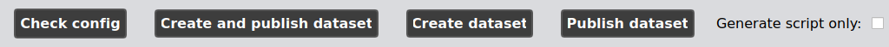

.. _guiusage:

*********************************
NeuroDataPub Assistant Guide
*********************************

Introduction
============

`NeuroDataPub` comes with a Graphical User Interface
aka the `NeuroDataPub Assistant` to support not only
the configuration of the siblings and the generation of the
corresponding JSON configuration files, but also its
execution in the three different modes.

1. Start the Graphical User Interface
======================================

In a terminal, activate the `neurodatapub-env` conda environment::

    $ conda activate neurodatapub-env

Please check :ref:`creation-conda-environment` for more details about its creation.

After activation, the `NeuroDataPub Assistant` can be launched
via the `neurodatapub` command-line interface with the `--gui` option flag:

    .. code-block:: console

       $ neurodatapub --gui \
            (--bids_dir '/local/path/to/input/bids/dataset' \)
            (--datalad_dir  '/local/path/to/output/datalad/dataset' \)
            (--git_annex_ssh_special_sibling_config '/local/path/to/special_annex_sibling_config.json' \)
            (--github_sibling_config '/local/path/to/github_sibling_config.json')

.. note:: When you run  the `neurodatapub` command-line interface with the `--gui` option, it is not required to
          specify the option flags required for a normal run from the commandline interface.
          However, if provided, the parameters will be used to initialize the configuration of the project.

2. Configure input and outputs directories
===========================================

You can select or reconfigure your input BIDS directory and the directory of the output
Datalad dataset in the first tab of the `NeuroDataPub Assistant`.

.. figure:: images/neurodatapub_main_window.png
    :align: center
    :width: 600

3. Configure the siblings
==========================

You can configure or reconfigure the settings for the special
git-annex and GitHub remote siblings.

.. figure:: images/neurodatapub_siblings_tab_window.png
    :align: center
    :width: 600

3.1 Special remote sibling settings
------------------------------------

* ``"remote_ssh_login"`` (mandatory): user login to the remote

* ``"remote_ssh_url"`` (mandatory): SSH-URL of the remote in the form `"ssh://..."`

* ``"remote_sibling_dir"`` (mandatory): Remote .git/ directory of the sibling dataset

3.2 GitHub sibling settings
----------------------------

* ``"github_login"`` (mandatory): user login to GitHub.

* ``"github_repo_name"`` (mandatory): Dataset repository name on GitHub

4. Check the configuration and execute `NeuroDataPub`
=====================================================

Before being able to initiate the processes of creation and/or publication
of the datalad dataset, you will need to make the `NeuroDataPub Assistant`
checking them out by clicking on the `Check config` button.

.. figure:: images/neurodatapub_check_config_button.png
    :align: center
    :width: 800

If the configuration is completely valid, this will enable the
`Create and Publish Dataset`, `Create Dataset`, and `Publish Dataset` buttons.

Then, you can execute `NeuroDataPub` in one of the three execution modes by clicking on one of the
buttons.

.. figure:: images/neurodatapub_execution.png
    :align: center
    :width: 800

.. note:: You can always see the execution progress by checking the standard outputs in the terminal,
    such as the following:

    .. code-block:: console

        $ neurodatapub --gui

        [...]

        ############################################
        # Check configuration
        ############################################

            * PyBIDS summary:
            BIDS Layout: ...localuser/Data/ds-sample | Subjects: 1 | Sessions: 1 | Runs: 0
            * remote_ssh_login: user
            * remote_ssh_url: ssh://stockage.server.ch
            * remote_sibling_dir: /home/user/Data/ds-sample/.git
            * github_login: user
            * github_repo_name: ds-sample

        Configuration is valid!
        ############################################

        ############################################
        # Creation of Datalad Dataset
        ############################################

        > Initialize the Datalad dataset /home/localuser/Data/ds-sample/derivative/neurodatapub-v0.1
        [INFO   ] Creating a new annex repo at /home/localuser/Data/ds-sample/derivative/neurodatapub-v0.1
        [INFO   ] Running procedure cfg_text2git
        [INFO   ] == Command start (output follows) =====
        [INFO   ] == Command exit (modification check follows) =====
        [INFO   ] Running procedure cfg_bids
        [INFO   ] == Command start (output follows) =====
        [INFO   ] Running procedure cfg_metadatatypes
        [INFO   ] == Command start (output follows) =====
        [INFO   ] == Command exit (modification check follows) =====
        [INFO   ] == Command exit (modification check follows) =====
        Dataset(/home/localuser/Data/ds-sample/derivative/neurodatapub-v0.1)

        [...]

Support, bugs and new feature requests
=======================================

All bugs, concerns and enhancement requests for this software are managed on GitHub and can be submitted at `https://github.com/NCCR-SYNAPSY/neurodatapub/issues <https://github.com/NCCR-SYNAPSY/neurodatapub/issues>`_.
