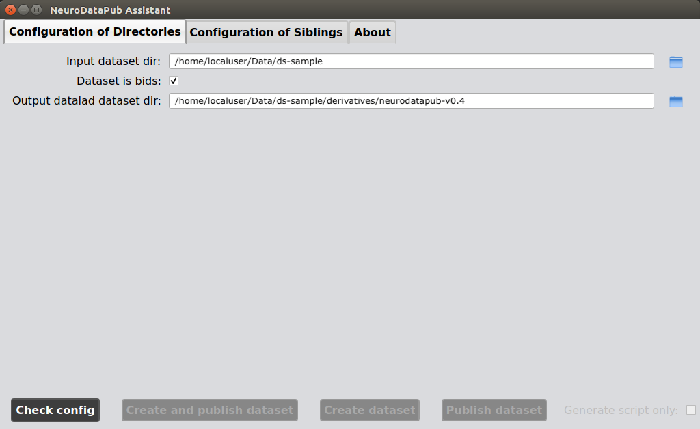
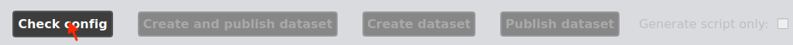
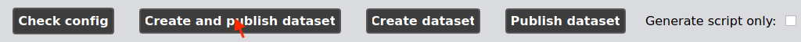

.. _guiusage:

*********************************
NeuroDataPub Assistant Guide
*********************************

.. important::
    Before using `NeuroDataPub`, the remote data server should provide at least an installation of `git-annex`. Please see :ref:`remote_setup` for instructions.

    Note also that `NeuroDataPub` takes as principal input the path of your dataset that should be compliant to the Brain Imaging Data Structure (BIDS) format
    by default.
    If you are using a dataset in BIDS format, you should always make sure that your dataset is in *valid BIDS format* before using `NeuroDataPub` using
    the free, online `BIDS Validator <http://bids-standard.github.io/bids-validator/>`_, or its standalone version.
    See :ref:`BIDS standard <bids>` for more information about BIDS.
    If it does not make any sense to adopt the BIDS format for your dataset, `NeuroDataPub` can also handle dataset not necessary in the BIDS format,
    since `v0.4`, with the `--is_not_bids` option.

Introduction
============

`NeuroDataPub` comes with a Graphical User Interface
aka the `NeuroDataPub Assistant` to support not only
the configuration of the siblings and the generation of the
corresponding JSON configuration files, but also its
execution in the three different modes.

1. Start the Graphical User Interface
======================================

In a terminal, activate the `neurodatapub-env` conda environment::

    $ conda activate neurodatapub-env

Please check :ref:`creation-conda-environment` for more details about its creation.

After activation, the `NeuroDataPub Assistant` can be launched
via the `neurodatapub` command-line interface with the `--gui` option flag:

    .. code-block:: console

       $ neurodatapub --gui \
            (--bids_dir '/local/path/to/input/bids/dataset' \)
            (--datalad_dir  '/local/path/to/output/datalad/dataset' \)
            (--git_annex_ssh_special_sibling_config '/local/path/to/special_annex_sibling_config.json' \)
            (--github_sibling_config '/local/path/to/github_sibling_config.json')
            (--osf_sibling_config '/local/path/to/osf_sibling_config.json')

.. note:: When you run  the `neurodatapub` command-line interface with the `--gui` option, it is not required to
          specify the option flags required for a normal run from the commandline interface.
          However, if provided, the parameters will be used to initialize the configuration of the project.

2. Configure input and outputs directories
===========================================

You can select or reconfigure your input dataset directory, its format (BIDS / non-BIDS) and the directory of the
  Datalad dataset that will be created in the first tab of the `NeuroDataPub Assistant`.

|

3. Configure the siblings
==========================

You can configure or reconfigure the settings for the special
git-annex and GitHub remote siblings.

|

3.1 Special remote sibling settings
------------------------------------

Since `v0.3`, you can use either (1) the data storage server of your institution accessible
via `ssh` or (2) the Open Science Foundation (OSF) platform to host your annexed files.

3.1.1 Server accessible via `ssh`
+++++++++++++++++++++++++++++++++

|
*   ``"remote_ssh_login"`` (mandatory): user's login to the remote

*   ``"remote_ssh_url"`` (mandatory): SSH-URL of the remote in the form `"ssh://..."`

*   ``"remote_sibling_dir"`` (mandatory): Remote .git/ directory of the sibling dataset

3.1.2 OSF (Cloud)
+++++++++++++++++

|
*   ``"osf_dataset_title"`` (mandatory): Dataset title on OSF.

*   ``"osf_token"`` (mandatory): user's OSF authentication token. To make a Personal Access Token, please go to the relevant `OSF settings page <https://osf.io/settings/tokens/>`_ and create one. If you do not an OSF account yet, you will need to create one a-priori.

3.2 GitHub sibling settings
----------------------------

|
*   ``"github_login"`` (mandatory): user's login to GitHub.

*   ``"github_email"`` (mandatory): user's email associated with GitHub account.

*   ``"github_organization"`` (mandatory): GitHub organization the GitHub account has access to.

*   ``"github_token"`` (mandatory): user's github authentication token. Please see `"Creating a personal access token" Github documentation <https://docs.github.com/en/github/authenticating-to-github/keeping-your-account-and-data-secure/creating-a-personal-access-token>`_ for more details on how to get one. Make also sure that the `write:org` and `read:org` options are enabled.

*   ``"github_repo_name"`` (mandatory): Dataset repository name on GitHub.

3.3 Create the JSON sibling configuration files
--------------------------------------------------

Settings for each of the different siblings can be saved in a JSON file by clicking
on their respective |save_button_img| button.

4. Check the configuration and run `NeuroDataPub`
==================================================

Before being able to initiate the processes of creation and/or publication
  of the datalad dataset, you will need to make the `NeuroDataPub Assistant`
  checking them out by clicking on the `Check config` button.

|
If the configuration is completely valid, this will enable the
  `Create and Publish Dataset`, `Create Dataset`, `Publish Dataset` buttons.

.. figure:: images/neurodatapub_exec_buttons_enable.png
    :align: center
    :width: 800
|
Then, you can run `NeuroDataPub` in one of the three execution modes by clicking on one of the
buttons.

|
.. note:: You can always see the execution progress by checking the standard outputs in the terminal,
    such as the following:

    .. code-block:: console

        $ neurodatapub --gui

        [...]

        ############################################
        # Check configuration
        ############################################

            * PyBIDS summary:
            BIDS Layout: ...localuser/Data/ds-sample | Subjects: 1 | Sessions: 1 | Runs: 0
            * remote_ssh_login: user
            * remote_ssh_url: ssh://stockage.server.ch
            * remote_sibling_dir: /home/user/Data/ds-sample/.git
            * github_login: user
            * github_repo_name: ds-sample

        Configuration is valid!
        ############################################

        ############################################
        # Creation of Datalad Dataset
        ############################################

        > Initialize the Datalad dataset /home/localuser/Data/ds-sample/derivative/neurodatapub-v0.1
        [INFO   ] Creating a new annex repo at /home/localuser/Data/ds-sample/derivative/neurodatapub-v0.1
        [INFO   ] Running procedure cfg_text2git
        [INFO   ] == Command start (output follows) =====
        [INFO   ] == Command exit (modification check follows) =====
        [INFO   ] Running procedure cfg_bids
        [INFO   ] == Command start (output follows) =====
        [INFO   ] Running procedure cfg_metadatatypes
        [INFO   ] == Command start (output follows) =====
        [INFO   ] == Command exit (modification check follows) =====
        [INFO   ] == Command exit (modification check follows) =====
        Dataset(/home/localuser/Data/ds-sample/derivative/neurodatapub-v0.1)

        [...]

.. admonition:: Need more control?

    Since `v0.4`, `NeuroDataPub` can be run in `Generate script only` mode to give more control to more advanced users familiar with the Linux shell.
    If enabled, `NeuroDataPub` will run in a "dryrun" mode and will only create a Linux shell script called `neurodatapub_%d-%m-%Y_%H-%M-%S.sh` in the `code`
      directory of your input dataset that records all the underlined commands.

    .. figure:: images/neurodatapub_generate_script_execution.png
    :align: center
    :width: 800

Support, bugs and new feature requests
=======================================

All bugs, concerns and enhancement requests for this software are managed on GitHub and can be submitted at `https://github.com/NCCR-SYNAPSY/neurodatapub/issues <https://github.com/NCCR-SYNAPSY/neurodatapub/issues>`_.
