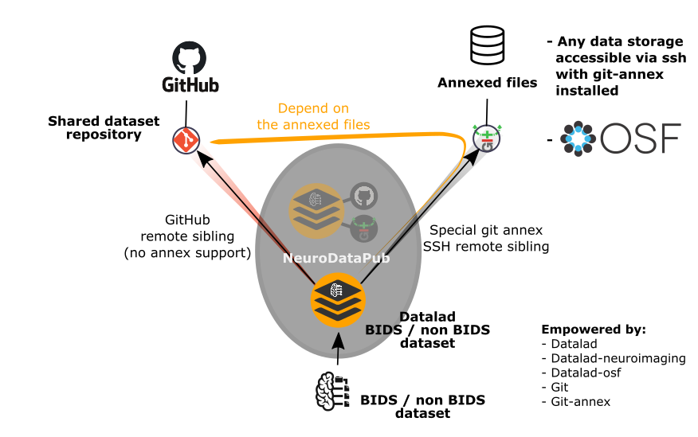

NeuroDataPub: NCCR-SYNAPSY Neuroimaging Dataset Publishing Tool
***************************************************************

**Latest released version:** |vrelease|

This tool is developed by the `Connectomics Lab <https://wp.unil.ch/connectomics/>`_ at the University Hospital of Lausanne (CHUV) for use
within the lab and within the `National Centre of Competence in Research (NCCR) "SYNAPSY – Synaptic Bases of Mental Diseases" NCCR-SYNAPSY <https://nccr-synapsy.ch/>`_,
as well as for open-source software distribution.

.. image:: https://img.shields.io/pypi/v/neurodatapub
  :target: https://pypi.org/project/neurodatapub/
  :alt: PyPI
.. image:: https://zenodo.org/badge/DOI/10.5281/zenodo.5163950.svg
  :target: https://doi.org/10.5281/zenodo.5163950
  :alt: Digital Object Identifier
.. image:: https://readthedocs.org/projects/neurodatapub/badge/?version=latest
  :target: https://neurodatapub.readthedocs.io/en/latest/?badge=latest
  :alt: Documentation Status
.. image:: https://circleci.com/gh/NCCR-SYNAPSY/neurodatapub/tree/main.svg?style=shield
  :target: https://circleci.com/gh/NCCR-SYNAPSY/neurodatapub/tree/main
  :alt: Circle CI
.. image:: https://img.shields.io/github/all-contributors/NCCR-SYNAPSY/neurodatapub
  :target:
  :alt: Github All Contributors  
.. image:: https://app.codacy.com/project/badge/Grade/e10b50b91e0f49b5866e527d3defd5ad
  :target: https://www.codacy.com?utm_source=github.com&amp;utm_medium=referral&amp;utm_content=NCCR-SYNAPSY/neurodatapub&amp;utm_campaign=Badge_Grade
  :alt: Code quality

Introduction
=============

`NeuroDataPub` is a `neuroimaging dataset publishing tool` written in Python and
built on top of `Datalad` and `git-annex`, that lowers the barriers, for the
NCCR-SYNAPSY members, to adopt Datalad to manage and publish, privately or publicly,
their dataset repository on GitHub and the annexed files on their SSH data server,
in order to fully fulfill the implemented Neuroimaging Data Management Plan.

Since `v0.3`, you can use either (1) a server accessible via `ssh` or (2) the
Open Science Foundation (OSF) platform, as a git-annex special remote, to host
your annexed files.

`NeuroDataPub` comes with its graphical user interface, aka the
`NeuroDataPub Assistant`, created to facilitate:

* the configuration of the siblings,
* the creation of the JSON configuration files, as well as
* the execution of `NeuroDataPub` in the three different modes.

Acknowledgment
--------------

If your are using `NeuroDataPub` in your work, please acknowledge
this software and its dependencies.
See :ref:`Citing <citing>` for more details.

License information
--------------------

This software is distributed under the open-source Apache 2.0 license. See :ref:`license <LICENSE>` for more details.

All trademarks referenced herein are property of their respective holders.

Help/Questions
---------------

If you run into any problems or have any code bugs or questions, please create a new `GitHub Issue <https://github.com/NCCR-SYNAPSY/neurodatapub/issues>`_.

Eager to contribute?
---------------------

See :ref:`Contributing <contributing>` for more details.

Funding
--------

Supported by the National Centre of Competence in Research (NCCR)
"SYNAPSY – Synaptic Bases of Mental Diseases" NCCR-SYNAPSY
(`NCCR-SYNAPSY website <https://nccr-synapsy.ch/>`_ / `NCCR-SYNAPSY Swiss National Science Foundation Page <https://www.snf.ch/en/rk1dIQvOuOCU9G4Z/page/researchinFocus/nccr/nccr-synapsy>`_) under `SNF-185897 grant <https://p3.snf.ch/project-185897>`_.

Contents
=========

.. _getting_started:

.. toctree::
   :maxdepth: 2
   :caption: Getting started

   installation
   remote_setup

.. _user-docs:

.. toctree::
   :maxdepth: 2
   :caption: User Documentation

   gui
   usage
   bids

.. _api-doc:

.. toctree::
   :maxdepth: 6
   :caption: API Documentation

   api_commandlineinterface
   api_project
   api_uiproject
   api_utils

.. _about-docs:

.. toctree::
   :maxdepth: 1
   :caption: About NeuroDataPub

   LICENSE
   citing
   changes
   contributing
   contributors
