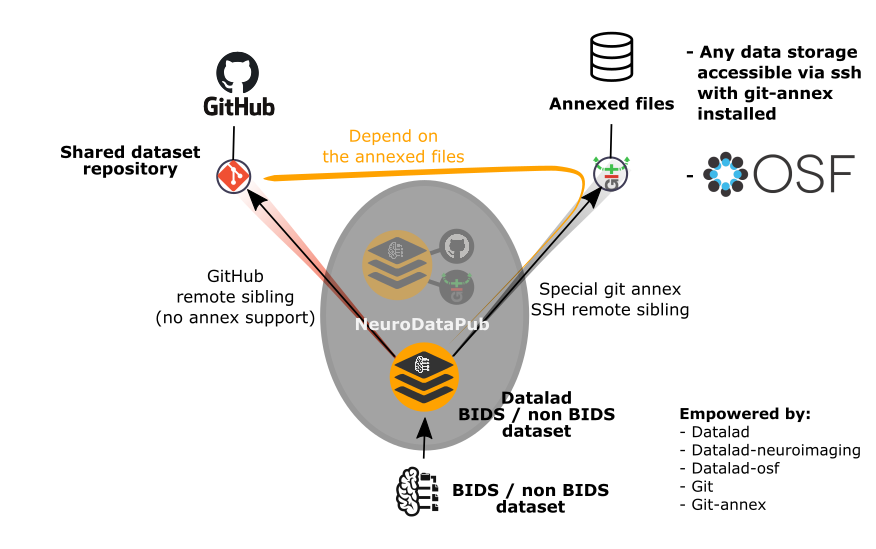

NeuroDataPub
************************************

**Latest released version:** |vrelease|

This tool is developed by the `Connectomics Lab <https://wp.unil.ch/connectomics/>`_ at the University Hospital of Lausanne (CHUV) for use
within the lab and within the `National Centre of Competence in Research (NCCR) "SYNAPSY – Synaptic Bases of Mental Diseases" NCCR-SYNAPSY <https://nccr-synapsy.ch/>`_,
as well as for open-source software distribution.

.. image:: https://img.shields.io/github/all-contributors/NCCR-SYNAPSY/neurodatapub
  :target:
  :alt: Github All Contributors  

Introduction
=============

`NeuroDataPub` is a `neuroimaging dataset publishing tool` built on top of
`Datalad` and `git-annex`, developed for the
NCCR-SYNAPSY members to lower the barriers in adopting Datalad to manage and publish
privately or publicly their dataset repository on GitHub and the
annexed files on their SSH data server.

`NeuroDataPub` comes with its graphical user interface, aka the
`NeuroDataPub Assistant`, created to facilitate:

* the configuration of the siblings,
* the creation of the JSON configuration files, as well as
* the execution of `NeuroDataPub` in the three different modes.

Aknowledgment
--------------

If your are using `NeuroDataPub` in your work, please acknowledge
this software and its dependencies.
See :ref:`Citing <citing>` for more details.

License information
--------------------

This software is distributed under the open-source Apache 2.0 license. See :ref:`license <LICENSE>` for more details.

All trademarks referenced herein are property of their respective holders.

Help/Questions
---------------

If you run into any problems or have any code bugs or questions, please create a new `GitHub Issue <https://github.com/NCCR-SYNAPSY/neurodatapub/issues>`_.

Eager to contribute?
---------------------

See :ref:`Contributing <contributing>` for more details.

Funding
--------

Supported by the National Centre of Competence in Research (NCCR) "SYNAPSY – Synaptic Bases of Mental Diseases" NCCR-SYNAPSY (grant TO BE UPDATED).

Contents
=========

.. _getting_started:

.. toctree::
   :maxdepth: 2
   :caption: Getting started

   installation

.. _user-docs:

.. toctree::
   :maxdepth: 2
   :caption: User Documentation

   gui
   usage
   bids

.. _api-doc:

.. toctree::
   :maxdepth: 6
   :caption: API Documentation

   api_commandlineinterface
   api_project
   api_uiproject
   api_utils

.. _about-docs:

.. toctree::
   :maxdepth: 1
   :caption: About NeuroDataPub

   LICENSE
   citing
   changes
   contributing
   contributors
